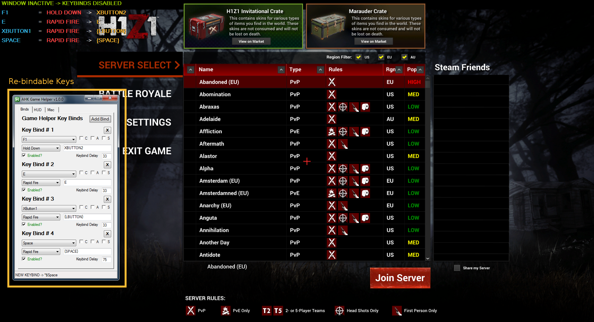
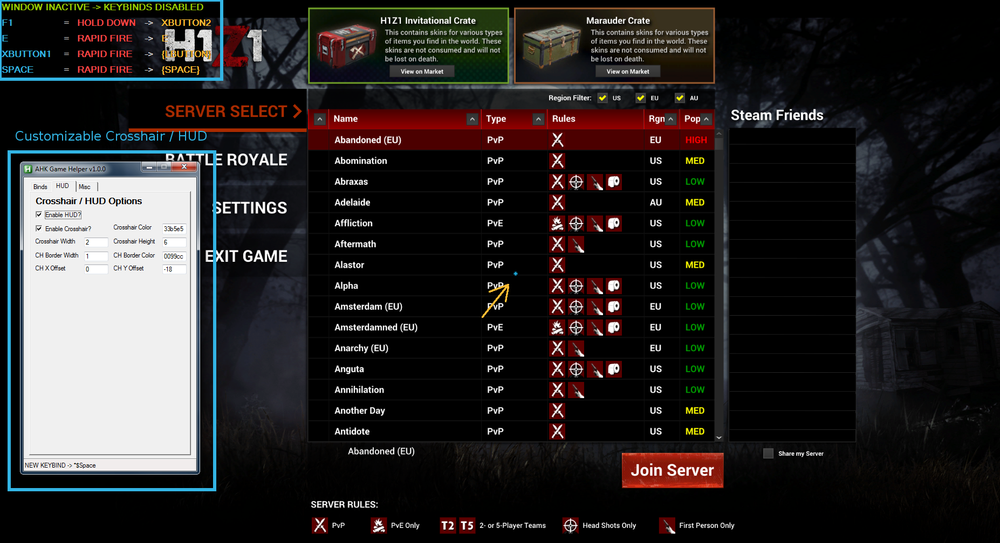
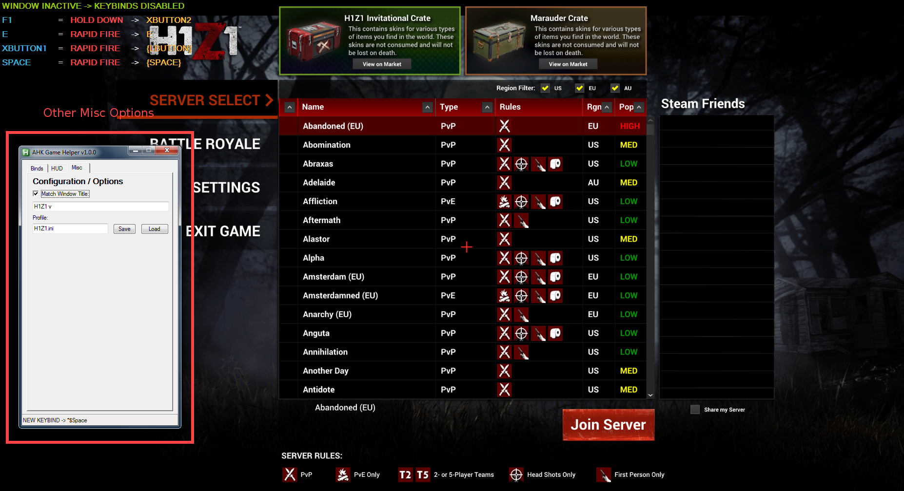

## AHK Game Helper
AHK Game Helper is a program written in AutoHotkey that is used to assist when playing games.

### Screenshots

### Features
- Customizable Crosshair Overlay
- Rebind Keys w/ Support For
    - Rapid Fire
    - Auto Fire
    - Hold Down
    - Send Text
    - Send Keys

### Uses
Here are some examples of what this program can assist with:
- Crosshair Overlay useful in shooter games such as H1Z1, Rust, Tribes
- Send chat messages quickly such as `come help me now!` or `enemy missing from lane` in games like LoL, DoTA2, HotS
- Rapid fire single-shot weapons like pistols in shooter games like H1Z1, CS-GO, etc
- Spam key sequences for attacking in action/mmo games (press 123456 over and over repeatedly etc)
- AutoRun in games that don't normally support it (bind a key to hold down w, etc)
- Spam mouse click on any application
- Optional HUD overlay showing above keybinds and their functions
- Optionally only trigger when window is matched

### Change Log
- **1.0.0**: Initial Release

### Suggestions?
- email me @ `mudz@charter.net`